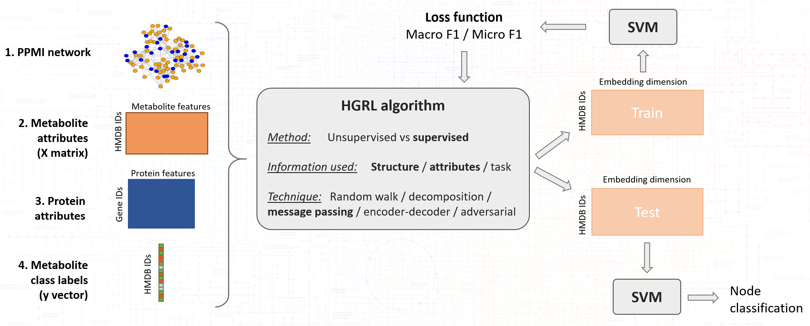
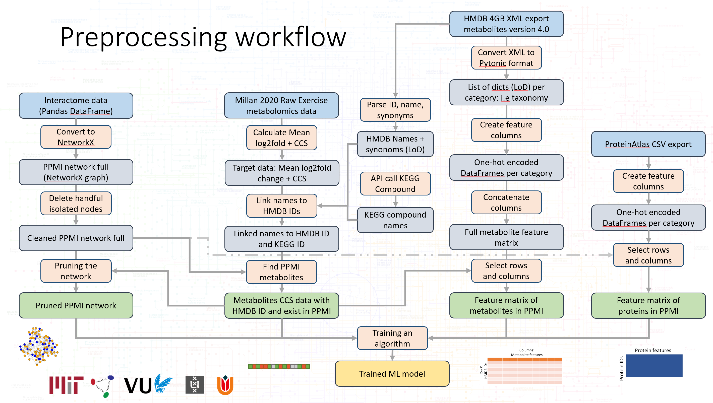
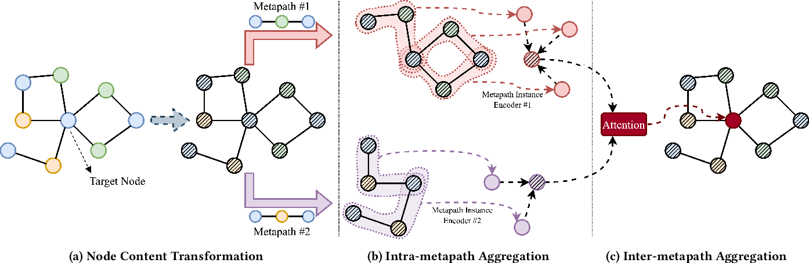

# Heterogeneous graph representation learning on protein-protein-metabolite interaction networks

This repository provides an implementation of [MAGNN](https://github.com/cynricfu/MAGNN) applied to the metabolite concentration change sign prediction task as described in the masters thesis manuscript by Nathan van der Lei, MSc Computational Science, UvA/VU, Amsterdam. This repository was developed in collaboration with the [Fraenkel Lab](http://fraenkel.mit.edu/), Department of Biological Engineering, MIT.

The thesis manuscript itself will become available at [Theses University of Amsterdam](https://scripties.uba.uva.nl)

## Project overview
The implementation proposed in this work uses 4 data components:
1. **PPMI network**: under active development at the [Fraenkel Lab](https://github.com/fraenkel-lab)
2. **Metabolite attributes**: with data from [HMDB 4.0 download](https://hmdb.ca/downloads)
3. **Protein attributes**: with data from [Protein Atlas download](https://www.proteinatlas.org/search)
4. **Metabolite class labels**: with data from San-Millán et al. (2020), available at [10.3389/fphys.2020.00578](https://doi.org/10.3389/fphys.2020.00578)

## Experimental setup

|   Methods / Data components   | Uses PPMI network | Uses metabolite attributes | Uses protein attributes | Uses node class labels |
|-----------------:|:-----------------:|:--------------------------:|:--------------------:|:----------------------:|
| **Baselines** |                   |              x             |                      |            x           |
|  **MAGNN 1**  |         x         |                            |                      |            x           |
|  **MAGNN 2**  |         x         |              x             |                      |            x           |
|  **MAGNN 3**  |         x         |              x             |           x          |            x           |

## Data download
1. Download ["Data.7z"](https://www.dropbox.com/s/idl0lrhpc8srw2q/Data.7z?dl=0) or ["Data.zip"](https://www.dropbox.com/s/1udccbsw81hkopa/Data.zip?dl=0) folder from Dropbox
2. Unzip "Data.zip" to the same parent directory as this repository
3. Your file structure should look as intended:
  - 📁 "YOUR parent directory"
    - 📄 Data.zip
    - 📁 Data
    - 📁 PPMI_MAGNN
    - ...  

## Usage
1. Download data (as described previously)
2. Use `preprocess_PPMI.ipynb` to prepare data for MAGNN and create / load a `Dataloader` object
3. Use `data_analysis.ipynb` to investigate the PPMI network, metabolite attributes, protein attributes, metabolite class labels
4. Use `baselines.ipynb` to train and test vanilla ML methods
5. Create `checkpoint/` folder in repository for model saving
6. Run the command `python run_PPMI.py` from terminal to train MAGNN
7. Use `inspect_model.ipynb` to investigate a trained model, access embeddings and visualize nodes
8. Use `compare_results.ipynb` to visualize experimental results

Run `python run_PPMI.py --help` for more information about the available options of the PPMI MAGNN implementation. 

## Dependencies

Recent versions of the following packages for Python 3 are required:
* PyTorch 1.2.0
* DGL 0.3.1
* NetworkX 2.3
* scikit-learn 0.21.3
* NumPy 1.17.2
* SciPy 1.3.1
* matplotlib_venn

## QA

**Q: What is this whole project about?**  
A: Metabolites are small molecules that interact in biochemical pathways. The metabolomics research field studies metabolites and is challenged with data engineering challenges. There are a lot of metabolites to be found in human biofluids like blood. Experimental results usually only report a small fraction of all metabolites, due to limitations in MS and NMR based measurements techniques. This project aims to predict unknown properties of metabolites that weren't measured in an experiment but could be infered from their known attributes and their role in known protein-protein-metabolite interaction networks. For this reason, heterogenous graph representation learning techniques in the form of the MAGNN algorithm are applied. Please read the thesis manuscript to better understand the challenges and nuances of this project.

**Q: Where can I find relevant code?**  
A: Some relevant code snippets are mentioned here:
- The `DataLoader` class in `PPMI_dataloader.py` can be used to perform the data preprocessing.
- The `ExerciseMetabolomicsDataLoader` class in `PPMI_dataloader.py` can be used to obtain mean log2fold change and CCS values per metabolite from a publication
- The `MetaboliteNameMatcher` class in `PPMI_dataloader.py` can be used to obtain HMDB IDs and KEGG IDs from metabolite name strings
- The `get_metapath_neighbor_pairs_PPMI_MP` function in `preprocess_PPMI.ipynb` can be used to obtain metapath instances by brute force search. The search is parallelized using `multiprocessing` for computational optimization.
- The `load_PPMI_data` function in `utils/data.py` is build to load data into MAGNN specific format.
- The `evaluate_results_nc` function in `utils/tools.py` is used to evaluate performance
- The relational rotation encoder is used when `--rnn-type RotatE0` is used in `run_PPMI.py`. The actual usage is implemented in the `forward` function in the `MAGNN_metapath_specific` class in `model/base_MAGNN.py`. This functionality allows metapath instance specific information like protein attributes to be included in the training process.
- `data_utils.py` is a utility script that allows for the `Data` folder to be outside the repository for easier collaboration and data sharing

**Q: How does the data preprocessing work?**  
A: Some preliminary data conversions were already done beforehand and the code for these conversion operations is available in `data_engineering` subfolders. Most preprocessing happens at initalization of a `DataLoader` object in `PPMI_dataloader.py`. Depending on some preprocessing settings the correct data is retrieved, combined and stored in the `DataLoader` class. The picture below illustrates the full preprocessing procedures, of which some happen in `data_engineering` and most happen in `DataLoader`. 

**Q: How does the MAGNN algorithm work?**  
A: Please refer to te original publication available at [arXiv:2002.01680](https://arxiv.org/abs/2002.01680) and original code base of [MAGNN](https://github.com/cynricfu/MAGNN) for full details. The algorithm essentially consists of 3 components:
1. Node content transformation
2. Intra-metapath aggregation
3. Inter-metapath aggregation

The picture below is taken from the original publication and graphically illustrates the working.

**Q: Where can I find the documentation?**  
A: The codebase is designed to be self contained and all relevant documentation can be found in the code itself. It is assumed users are fluent in Python and are able to work with jupyter notebooks and terminal scripts by themselves.

<!-- **Q: Is there a Docker image available?**  
A: currently there is no Docker image available for this project. -->

**Q: How can I make predictions for a new metabolomics publication?**  
A: The publication should contain supplementary data on metabolite abundances pre and post intervention. The data files should be uploaded into the correct data folder in the correct format.

**Q: Why are there different version of the MAGNN model?**  
A: In the `model` folder there are different versions of the MAGNN model, because:
- `nc` means node classification.
- `lp` means link prediction.
- `MAGNN_nc.py` is for whole-batch training
- `MAGNN_nc_mb.py` is for mini-batched training

This work uses the latter `MAGNN_nc_mb` for node classification and working in batches.

**Q: How to cite this work?**  
A: if you find this work useful, please consider citing:

    @MastersThesis{vanderlei_2021_heterogeneous,
        title={Heterogeneous graph representation learning on protein-protein-metabolite interaction networks},
        author={van der Lei, Nathan M},
        school={University of Amsterdam}
        year={2021}}  

## Resources

- Sportomics publication used to obtain metabolite class labels:
> Metabolomics of Endurance Capacity in World Tour Professional Cyclists  
> San-Millán, I., Stefanoni, D., Martinez, J. L., Hansen, K. C., D’Alessandro, A., & Nemkov, T.  
> Frontiers in Physiology, 2020, 11: 578  
> DOI: [10.3389/fphys.2020.00578](https://doi.org/10.3389/fphys.2020.00578)

- Code implemention builds on top of MAGNN:
> MAGNN: Metapath Aggregated Graph Neural Network for Heterogeneous Graph Embedding. 
> Xinyu Fu, Jiani Zhang, Ziqiao Meng, Irwin King. 
> The Web Conference, 2020.  
> EPrint: [arXiv:2002.01680](https://arxiv.org/abs/2002.01680)

- Human metabolome Database (HMDB) for feature engineering:
> HMDB 4.0: the human metabolome database for 2018. 
> David S Wishart et al.  
> Nucleic Acids Research, Vol. 46, Oxford University Press (OUP)  
> DOI: [10.1093/nar/gkx1089](https://doi.org/10.1093/nar/gkx1089)  
> URL: [hmdb.ca](https://hmdb.ca/)

<!-- - [Markdown-cheat-sheet](https://github.com/adam-p/markdown-here/wiki/Markdown-Cheatsheet)
- [Emoji-cheat-sheet](https://github.com/ikatyang/emoji-cheat-sheet) -->

## MAGNN specifics

### Other benchmark datasets

The preprocessed datasets used in MAGNN benchmarking are available at:
* IMDb - [Dropbox](https://www.dropbox.com/s/g0btk9ctr1es39x/IMDB_processed.zip?dl=0)
* DBLP - [Dropbox](https://www.dropbox.com/s/yh4grpeks87ugr2/DBLP_processed.zip?dl=0)
* Last.fm - [Dropbox](https://www.dropbox.com/s/jvlbs09pz6zwcka/LastFM_processed.zip?dl=0)

<!-- The GloVe word vectors are obtained from [GloVe](https://nlp.stanford.edu/projects/glove/). Here is [the direct link](http://nlp.stanford.edu/data/glove.6B.zip) for the version we used in DBLP preprocessing.
 -->
### Usage of benchmark datasets

1. Create `checkpoint/` and `data/preprocessed` directories
2. Extract the zip file downloaded from the section above to `data/preprocessed`
    * E.g., extract the content of `IMDB_processed.zip` to `data/preprocessed/IMDB_processed`
2. Execute one of the following three commands from the project home directory:
    * `python run_IMDB.py`
    * `python run_DBLP.py`
    * `python run_LastFM.py`

For more details, please visit the original [MAGNN](https://github.com/cynricfu/MAGNN) repository. 
